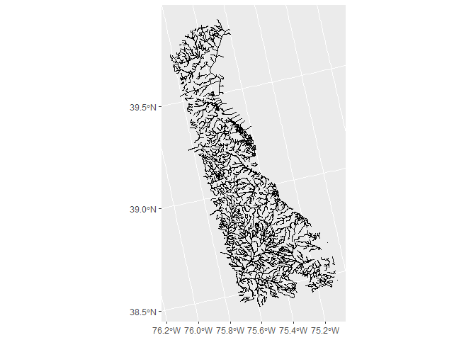

<!-- README.md is generated from README.Rmd. Please edit that file -->

# CASToolBaseDataPckg

<!-- badges: start -->
<!-- badges: end -->

The goal of CASToolBaseDataPckg is to serve state boundaries and
NHDPlusV2 reaches to the CASTool.

## Installation

You can install the development version of CASToolBaseDataPckg from
[GitHub](https://github.com/) with:

``` r
# install.packages("pak")
pak::pak("laura-naslund/CASToolBaseDataPckg")
```

## Example

This is a basic example of how to retrieve state boundaries and reaches.

``` r
library(CASToolBaseDataPckg)

## Retrieve state boundary
de_boundary <- retrieve_boundary("Delaware")
ggplot2::ggplot(de_boundary)+
  ggplot2::geom_sf()
```


``` r

## Retrieve state reaches
de_reaches <- retrieve_reaches("Delaware")
ggplot2::ggplot(de_reaches)+
  ggplot2::geom_sf()
```



## Currently available regions

``` r
data("available_regions")

available_regions
#>           Region
#> 1       Delaware
#> 2       Maryland
#> 3 North Carolina
#> 4         Oregon
#> 5     Washington
```
